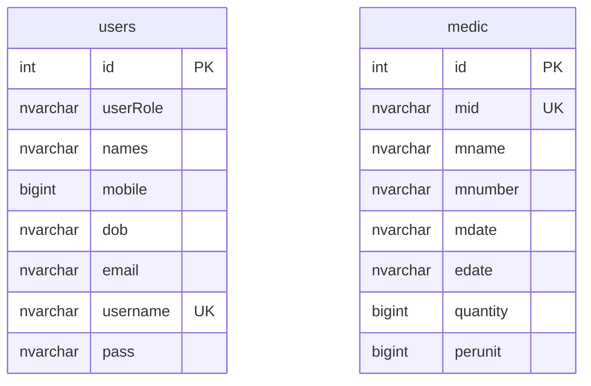

# Pharmacy Management System

[](https://github.com/noaman03/pharmacy-management-system/actions/workflows/build.yml)

A C# Windows Forms and SQL Server desktop application for pharmacy user administration, medicine inventory, sales, and stock updates.

## Project Status

This is a desktop learning project with a build workflow and local database schema. It is appropriate for demonstration with synthetic data, not for real pharmacy, patient, prescription, or payment data.

No application screenshots are currently committed; files under `images/` are interface assets rather than a screenshot gallery.

## Local Demo Credential

> When the `users` table is empty, the application accepts the bootstrap login `root` / `root`. This is only for local demonstration and initial administrator creation. It is hardcoded in `PharmacyManagement/Form1.cs` and is not safe for deployment.

## Roles and Features

| Role | Verified capabilities |
| --- | --- |
| Administrator | Open the administrator dashboard, add users, view users, edit the current profile, and manage user records. |
| Pharmacist | Open the pharmacist dashboard, add medicines, view/search/update inventory, validate medicine availability, build a sales cart, and reduce stock when completing a sale. |

## Technology Stack

- C# and Windows Forms
- .NET Framework 4.8
- SQL Server LocalDB or SQL Server Express
- ADO.NET with `System.Data.SqlClient`
- Guna.UI2.WinForms controls through NuGet
- GitHub Actions on Windows for restore and build

## Database

Run `database/schema.sql` to create the `pharmacy` database and its two tables.



No foreign-key relationship is declared between `users` and `medic`. Date fields and passwords are stored as text in the current schema.

## Prerequisites

- Windows
- Visual Studio 2022
- `.NET desktop development` workload
- .NET Framework 4.8 targeting pack
- SQL Server LocalDB or SQL Server Express
- SQL Server Management Studio or Azure Data Studio

## Installation

```powershell
git clone https://github.com/noaman03/pharmacy-management-system.git
cd pharmacy-management-system
```

1. Open SQL Server Management Studio or Azure Data Studio.
2. Connect to the SQL Server instance you intend to use.
3. Run `database/schema.sql`.
4. Open `PharmacyManagement.sln` in Visual Studio.
5. Restore NuGet packages.
6. Build and run the application.

## Connection Configuration

`PharmacyManagement/App.config` defines a connection named `PharmacyDatabase`:

```text
Data Source=(LocalDB)\MSSQLLocalDB;Initial Catalog=pharmacy;Integrated Security=True;TrustServerCertificate=True
```

Change that connection string for your local SQL Server instance when needed. Do not commit production database passwords or environment-specific credentials.

## Build Validation

Visual Studio is the simplest local build path. From a Developer PowerShell prompt, the solution can also be restored and built with:

```powershell
msbuild PharmacyManagement.sln /restore /p:Configuration=Release /p:Platform="Any CPU"
```

The repository includes `.github/workflows/build.yml`, which restores NuGet packages and builds the solution on a Windows runner.

## Project Structure

```text
PharmacyManagement.sln
PharmacyManagement/
  AdminstratorUC/             Administrator user controls
  PharmacistUC/              Pharmacist inventory and sales controls
  App.config                 SQL Server connection string
database/
  schema.sql                 Database and table creation script
docs/                        Setup and repository notes
images/                      Interface image assets
```

## SQL Server Troubleshooting

- Confirm the `(LocalDB)\MSSQLLocalDB` instance is installed and running.
- Verify that the `pharmacy` database was created in the same instance named in `App.config`.
- If using SQL Server Express, replace the data source with the actual instance name.
- Keep `Initial Catalog=pharmacy` aligned with `database/schema.sql`.
- Confirm the Windows account running the app can use Integrated Security.
- Restore NuGet packages before diagnosing missing Guna.UI2 controls.
- If a local certificate error occurs, review the SQL Server trust configuration instead of copying a production password into source.

## Security Notes

The current `users.pass` field stores passwords as text, and the bootstrap credential is hardcoded. Before any operational use:

- Replace plaintext password storage with a salted password hash and migration plan.
- Remove the hardcoded bootstrap login.
- Enforce authorization at every sensitive action, not only through navigation.
- Move deployment-specific connection settings out of committed configuration.
- Add audit logs, backups, recovery procedures, and input validation.

See [`SECURITY.md`](SECURITY.md) for the repository security notice.

## Known Limitations

- No patient, prescription, supplier, or payment model is implemented.
- Password handling is not suitable for real accounts.
- Dates are stored as `NVARCHAR` rather than SQL date types.
- The two database tables have no declared relationship.
- Automated database and interface tests were not found.

## License

No software license has been selected. The absence of a license means reuse rights have not been granted.

## Contact

[Ahmed Noaman](https://github.com/noaman03) | [LinkedIn](https://www.linkedin.com/in/ahmed-noaman-07ab162b4)
